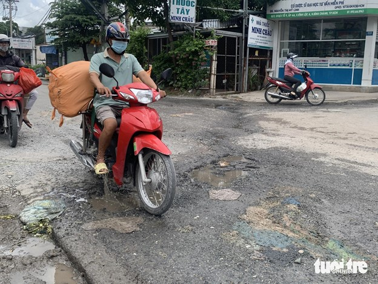

# Pothole_Detector
Pothole detector based on yolov5 architecture. 



## Table of Contents
- [About the Project](#about-the-project)
- [Hardware Used](#hardware-used)
- [Getting Started](#getting-started)
  - [Creating Own Model on Windows](#CreatingOwnModelonWindows)
  - [Running Inference on Raspberry PI ](#RunningInferenceonRaspberryPI)
- [Contact](#contact)

## About the project
Since I followed the course [Deep Learning Specialization by Andrew Ng](https://www.coursera.org/specializations/deep-learning?utm_medium=sem&utm_source=gg&utm_campaign=b2c_emea_deep-learning_deeplearning-ai_ftcof_specializations_arte_feb_24_dr_geo-multi_pmax_gads_lg-all&campaignid=21028581571&adgroupid=&device=c&keyword=&matchtype=&network=x&devicemodel=&adposition=&creativeid=&hide_mobile_promo&gad_source=1&gclid=Cj0KCQjwm5e5BhCWARIsANwm06hhA8wU2kgWbyL88m20hSBcq-o6h4FvIAxpVgKr8UjwtD9oQDfUDPIaAkkVEALw_wcB) on Coursera I got very interested in object detection and computer vision. 
Therefore, I wanted to make a project using computer vision. 
Since I will be going on a trip to Vietnam with a motorcycle, and considering the danger of driving in a pothole with a motorcycle, I wanted to make a pothole detector, using hardware that I could take on my trip to Vietnam. The idea was to use a [raspberry pi](https://www.raspberrypi.com/) to perform object detection and make a sound to alert me and my companions while driving the roads of Vietnam. 

## Hardware Used
I used the most recent Raspberry Pi (v5) with 8GB of RAM for the project. For Vietnam, I also included an active cooler fan, a case, and a tripod to mount the camera somewhere on the motorcycle. 
- [Raspberry Pi 5 8GB RAM](https://www.raspberrystore.nl/PrestaShop/nl/raspberry-pi-5/508-raspberry-pi-5-8gb-5056561803326.html)
- [Camera Module 3](https://www.amazon.de/dp/B0BRY6MVXL?ref=ppx_yo2ov_dt_b_fed_asin_title)
- [Active Cooler Fan](https://www.amazon.de/dp/B0CLXZBR5P?ref=ppx_yo2ov_dt_b_fed_asin_title) 
- [Camera cable to Raspberry Pi 5](https://www.amazon.de/-/en/dp/B079H33VCM?ref=ppx_yo2ov_dt_b_fed_asin_title&th=1) 
- [Tripod for Camera](https://www.amazon.de/-/en/dp/B0D6NGGPQM?ref=ppx_yo2ov_dt_b_fed_asin_title) 
- [Raspberry Pi Case](https://www.amazon.de/-/en/dp/B0CRB3DT5M?ref=ppx_yo2ov_dt_b_fed_asin_title)

## Getting Started
In this section, everything that is required to download and run the code is shown below. 

### Creating Own Model on Windows
1. Python installation: [Python Installation](https://www.python.org/downloads/)
2. The dataset used for training the pothole detector can be found on [Kaggle: Pothole Detector Dataset](https://www.kaggle.com/datasets/vincenttgre/pothole-detector-dataset-augmented). 

#### Installation
##### 1. Create a virtual environment with Python
1. Open Command Prompt.
2. Navigate to your project directory:
    ```bash
    cd path\to\your\project
    ```
3. Create a virtual environment:
    ```bash
    python -m venv env
    ```
4. Activate the virtual environment:
    ```bash
    .\env\Scripts\activate
    ```

##### 2. Clone the GitHub Repository
Clone the repository to your local machine:

1. Open your terminal or command prompt.
2. Navigate to the directory where you want to clone the repository.
3. Clone the repo using `git`:
    ```bash
    git clone https://github.com/vincentmaesGitty/Pothole_Detector.git
    ```
##### 3. Install the requirements
With the virtual environment activated and the repository cloned, you can install the necessary dependencies:

1. Navigate to the cloned repository directory:
    ```bash
    cd your/path/Pothole_Detector
    ```
2. Install the requirements using `pip`:
    ```bash
    pip install -r requirements.txt
    ```
##### 4. Prepare the Dataset
1. Download the Dataset: After downloading the dataset from Kaggle, unzip it.
2. Place Dataset in the Repository Folder:
Move the dataset to the yolov5_PI/data folder within the repository.
3. Edit the PotholeDetection.yaml File:
- Open PotholeDetection.yaml in the yolov5_PI/data folder.
- Update the path variable with the correct path to your dataset, and ensure the train, val, and test folders match the dataset structure.

##### 5. Training the Model
To train the model, use the command prompt, with the activated environment and type the following:
```bash
    python train.py --img 640 --batch 16 --epochs 15 --data yolov5_PI/data/PotholeDetection.yaml --weights yolov5s.pt
```
Explanation of command options:

- img: Image size for training (e.g., 640).
- batch: Batch size (e.g., 16). Go to 32 if your system can handle it. 
- epochs: Number of training epochs (e.g., 15). (Check the convergence of the system, if the test/train loss converges to a give value, you can stop the training early)
- data: Path to the .yaml file with dataset configuration.
- weights: Pretrained weights to use (choose from yolov5s.pt, yolov5m.pt, yolov5l.pt, yolov5x.pt).

YOLOv5 offers different pre-trained model types. Here’s a quick overview to help you select the best one:
- **yolov5s.pt: Smallest, fastest model, best for lightweight tasks or devices with limited resources.**
- yolov5m.pt: Medium-sized model, balanced between speed and accuracy.
- yolov5l.pt: Large model, better accuracy but requires more computational power.
- yolov5x.pt: Extra-large model, highest accuracy but slowest; best for high-end machines or tasks requiring maximum precision.


If you run into an error such as:
*OMP: Error #15: Initializing libiomp5md.dll, but found libiomp5md.dll already initialized.
OMP: Hint This means that multiple copies of the OpenMP runtime have been linked into the program. That is dangerous, since it can degrade performance or cause incorrect results. The best thing to do is to ensure that only a single OpenMP runtime is linked into the process, e.g. by avoiding static linking of the OpenMP runtime in any library. As an unsafe, unsupported, undocumented workaround you can set the environment variable KMP_DUPLICATE_LIB_OK=TRUE to allow the program to continue to execute, but that may cause crashes or silently produce incorrect results. For more information, please see http://www.intel.com/software/products/support/.*

The following will remedy this error and allow you to still train a model. 

```bash
    set KMP_DUPLICATE_LIB_OK=TRUE
```

### Running Inference on Raspberry PI 

#### Requirements
Before you begin, ensure you have met the following requirements:
- A Raspberry Pi with Raspbian installed
- An internet connection
- A PiCamera module

##### 1. Update/Upgrade/Virtual Environment/Clone Github Repo
First, update and upgrade your Raspberry Pi:
```bash
sudo apt update
sudo apt upgrade -y
```
Create a virtual environment:
```bash
python -m venv env
```
Activate the virtual environment:
```bash
source .\env\bin\activate
```
Then clone the GitHub repository and navigate to its directory. 
```bash
git clone https://github.com/vincentmaesGitty/Pothole_Detector.git
```

##### 2. Install Dependencies
```bash
sudo apt install python3-pip python3-venv libatlas-base-dev libjpeg-dev libtiff5-dev libjasper-dev libpng12-dev libhdf5-dev libhdf5-serial-dev libhdf5-100 libqtgui4 libqt4-test libatlas-base-dev libjasper-dev libqtgui4 libqt4-test -y
sudo apt install picamera2 -y
sudo apt install opencv-python torch==2.5.1 torchvision==0.20.1 matplotlib
sudo apt install -r requirements.txt
```
##### 3. Run Inference
1. Edit the path in the Main_Picamera_Inference.py to the weights of your trained model e.g. "best.pt".
2. Run the following:
```bash
python Main_Picamera_Inference.py
```


## Contact 
Contact me on Linkedin using [My Linkedin](https://www.linkedin.com/in/vincent-maes/)
